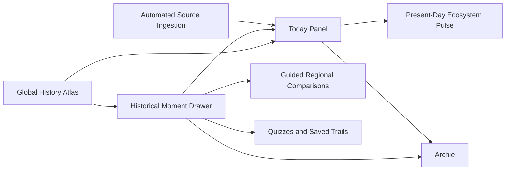

# Product Plan: Knewzly

> Status: Approved
> Updated: 2026-08-09

## Vision

Knewzly is a history-first global insight engine for understanding the technological and philosophical innovations that brought AI to the present. Learners explore a horizontal timeline organized into continent lanes, inspect historical moments in simple English, and connect current news to the history that shaped it. The product treats insight as the result of connecting events to the past and iterating on prior ideas.

## Steering Context

- Product: `.ai/steering/product.md`
- Tech Stack: `.ai/steering/tech-stack.md`
- Conventions: `.ai/steering/conventions.md`
- Principles: `.ai/steering/principles.md`

## Personas

- **Curious learner:** Wants an approachable way to understand how AI developed across places and periods.
- **Guided learner:** Wants a structured path through events, people, related topics, and current examples rather than an unbounded feed.

The first experience should be understandable to a 16-year-old reader without flattening historical nuance.

## Product Shape Decided So Far

- Knewzly opens on the history timeline, not on current news.
- The atlas is a horizontal timeline with parallel continent lanes.
- Cross-continent relationships use visible but subdued connection arcs, emphasized on hover or selection.
- Selecting a historical moment opens a context drawer that keeps the timeline visible.
- Current news lives in an attached Today panel with common-topic filters, user-defined topics, and links back to historical origins.
- The Today update mechanism (API, hook, or RSS) remains a technical design question.

## MVP Boundary

The following boundary is approved as the project-level planning baseline. Feature-level requirements, design, and tasks still require their own explicit approval gates.

### Candidate Must Have

- A globally scoped historical timeline with continent lanes that helps learners explain origins and cross-regional connections.
- An initial curated global spine of pivotal moments, designed to deepen and expand over time.
- A historical-moment context drawer with a simple-English story, key people, related topics, sources, and typed connections.
- A bounded Today panel with common and user-defined topics, a small curated current-news slice, and trace-to-origin links that prove the history-to-present insight loop.

### Candidate Should Have

- Guided regional comparisons.
- Quizzes and saved trails.
- Archie, the history-desk companion, bound by a defined answer/citation/uncertainty contract.

### Candidate Could Have

- Automated source ingestion.
- Deeper personalization and saved learner state.

### Candidate Won't Have Yet

- A broad present-day AI ecosystem pulse.

## Candidate Feature Map

These IDs are planning candidates and become feature specs only after the plan and MVP boundary are approved.

### Phase 1 — MVP / Must Have (Candidate)

| ID | Feature | Module | Description |
|----|---------|--------|-------------|
| F01 | Global History Atlas | Timeline | Browse AI and innovation history by time and continent, with cross-continent arcs. |
| F02 | Historical Moment Drawer | Learning | Read a simple-English story, key people, related topics, sources, and typed connections while keeping the atlas in context. |
| F03 | Today Panel | News connections | Filter a bounded current-news slice by common or user-defined topics and trace stories to historical origins. |

### Phase 2 — Essentials / Should Have (Candidate)

| ID | Feature | Module | Description |
|----|---------|--------|-------------|
| F04 | Guided Regional Comparisons | Learning | Compare connected developments across continent lanes. |
| F05 | Quizzes and Saved Trails | Learning | Reinforce understanding and let learners retain meaningful paths through the atlas. |
| F08 | Archie — History Desk Companion | Learning | AI companion that answers questions using the atlas and Today panel: typed claims (fact/interpretation/hypothesis/conceptual analogy), visible uncertainty and competing interpretations, sourced+dated+freshness citations, topic filtering, historical tracing, further-reading recommendations, and a labeled-explainer export — bound by a hard no-fabrication rule. |

### Phase 3 — Nice to Have / Could Have (Candidate)

| ID | Feature | Module | Description |
|----|---------|--------|-------------|
| F06 | Automated Source Ingestion | Content operations | Update historical and current content through a governed source pipeline. |
| F07 | Present-Day Ecosystem Pulse | News connections | Show a broader current AI ecosystem view after the history-first foundation is proven. |

## Dependencies

These dependencies are planning decisions, not implementation authorization.

## Open Decisions

- Which exact anchor events and sources should populate the first curated spine? (Requirements work.)
- Which topic taxonomy and refresh policy should the Today panel use? (Design work.)
- Which accounts, saved state, and personalization boundaries should a later phase support? (Requirements work.)
- Which visual density, zoom, responsive behavior, and arc-decluttering rules should the design specify? (Design work.)

## Wayfinder Map

The local Markdown map follows Wayfinder's destination/frontier model. It is planning evidence and cannot approve requirements, design, or tasks.

### Destination

Reach a plan and first-feature boundary that make Knewzly's history-first visual journey clear enough to hand into requirements: a global timeline, contextual historical learning, and an intentionally connected Today experience.

### Notes

- Domain: global AI and innovation history, learner experience, current-news connections.
- Skills: `sdd-plan`, Wayfinder (adapted to local Markdown), later `sdd-prd` and `review-product-design` when the relevant gates are reached.
- Resolve one major frontier decision at a time.
- Keep product decisions separate from API, feed, and implementation choices.

### Decisions So Far

- [Knewzly Core Journey Destination](#knewzly-core-journey-destination) — Global AI history with current news connected to origins.
- [Timeline-First Entry](#timeline-first-entry) — The history atlas is the default home.
- [Horizontal Continent Lanes](#horizontal-continent-lanes) — A shared time axis organizes parallel continent lanes.
- [Attached Today Panel](#attached-today-panel) — Current news is a secondary panel with topic filters and trace-to-origin links.
- [Historical Context Drawer](#historical-context-drawer) — Moments open in context while the atlas remains visible.
- [Subdued Cross-Continent Arcs](#subdued-cross-continent-arcs) — Connections are visible but become prominent on interaction.
- [First Learning Outcome](#first-learning-outcome) — The MVP should help learners explain origins, people, ideas, and cross-regional connections.
- [Expandable Curated Global Spine](#expandable-curated-global-spine) — Start with a deliberate global set, then deepen and expand coverage over time.
- [Timeline Video Gap Review](#timeline-video-gap-review) — The reference video supplies a strong technical chronology; Knewzly needs philosophy, global context, infrastructure, data, non-LLM branches, and typed relationships.
- [Parallel Philosophy Lane](#parallel-philosophy-lane) — Philosophy remains a visible conceptual lane connected to technical and geographic events.
- [Balanced Bridge Seed Set](#balanced-bridge-seed-set) — Each section connects technical, philosophical, regional, and ecosystem context.
- [Expandable Anchor Events](#expandable-anchor-events) — The timeline stays at anchor depth while drawers can grow into medium-depth learning pages.

- [Expanded Anchor Content](#expanded-anchor-content) - Expanded drawers combine story, evidence, and connections.
- [Curated Balanced Anchor Spine](#curated-balanced-anchor-spine) - Begin with approximately 24-30 anchor events across ten connective clusters.
- [Insight Validation Loop](#insight-validation-loop) - Show what came before, what changed, and what followed without making MVP a scored quiz.
- [Today Panel MVP Slice](#today-panel-mvp-slice) - Keep current news bounded and directly connected to historical origins.
- [Source and Provenance Baseline](#source-and-provenance-baseline) - Make attribution, claim type, confidence, and uncertainty visible.
- [Deferred Retention Features](#deferred-retention-features) - Defer quizzes and saved trails to the next phase.
- [Responsive Interaction Baseline](#responsive-interaction-baseline) - Design desktop-first for the wide atlas while preserving a mobile drawer path.
- [Relationship Vocabulary](#relationship-vocabulary) - Use typed edges for influence, enablement, reaction, iteration, institutionalization, regulation, and conceptual lens.
- [Archie Deferral Lifted](#archie-deferral-lifted) - `product-design-review.md` deferred Archie pending a concrete answer/citation/uncertainty contract; `archie-companion-concept.html` proposes that contract, and Henry directed moving Archie into the candidate plan as F08.

### Frontier

No unresolved Wayfinder decisions remain after Henry authorized applying the recommendations. Remaining details are requirements and design work, not hidden planning decisions.

### Not Yet Specified

- The exact event list and source selection for the first spine.
- The exact visual language for event density, zoom, mobile behavior, and arc decluttering.
- News-source eligibility, refresh policy, rights, and provenance implementation.
- Accounts, saved state, and personalization boundaries.

### Out of Scope

- Implementation code during Wayfinding and planning.
- Selecting an API, hook, RSS provider, framework, or hosting platform before approved requirements and design.
- Treating the present-day ecosystem pulse, automated ingestion, quizzes, or saved trails as MVP commitments.

## Wayfinder Ticket Detail

### Knewzly Core Journey Destination

**Resolution:** Knewzly is a global place to learn the history of AI and the technological and philosophical innovation that produced the present. Current news can be filtered by common or user-defined topics and connected to historical origins.

### Timeline-First Entry

**Resolution:** Open on the history atlas. Current news is a secondary connected layer, not the default home feed.

### Horizontal Continent Lanes

**Resolution:** Use a shared horizontal time axis with parallel continent lanes.

### Attached Today Panel

**Resolution:** Keep current news in an attached Today panel with topic filters, custom topics, and trace-to-origin links. The update mechanism remains open for design.

### Historical Context Drawer

**Resolution:** Open historical moments in a context drawer that preserves the visible timeline and provides a simple-English mini-Wikipedia style summary, key people, related topics, and sources.

### Subdued Cross-Continent Arcs

**Resolution:** Draw visible but subdued arcs between related events across continent lanes and emphasize them on hover or selection.

### First Learning Outcome

**Resolution:** Knewzly's first release should help a learner explain where an innovation came from, who and what shaped it, and how ideas or events connected across regions and time. The product should make insight possible by connecting present events to the past and showing how iteration on prior ideas drives innovation.

### Timeline Video Gap Review

**Resolution:** The reference video provides a strong technical chronology from wartime codebreaking through current multimodal systems, but it leaves meaningful gaps in philosophical ancestry, global and institutional origins, infrastructure, data and labor, the model-development bridge to LLMs, non-LLM ecosystem branches, governance feedback loops, typed relationships, and uncertainty/provenance. See `.ai/sdd/research/initial-timeline-video-gap-analysis.md`.

### Parallel Philosophy Lane

**Resolution:** Philosophy should be a persistent parallel lane connected to technical and geographic events. It can present Aristotle, Kant, Hegel, Wittgenstein, Heidegger, Gadamer, Daoist automata, and Shinto animism as conceptual ancestry or interpretive lenses while clearly distinguishing those relationships from direct engineering causation.

### Balanced Bridge Seed Set

**Resolution:** The first curated spine should balance technical milestones, philosophical concepts, regional contributors, and ecosystem conditions in each section. Philosophy should not be decorative context added after the technical chronology.

### Expandable Anchor Events

**Resolution:** Use anchor events as the default timeline unit. A learner can expand an anchor from the concise timeline state into a medium-depth context drawer later, allowing richer mini-Wikipedia treatment without making the initial atlas dense.

### Expandable Curated Global Spine

**Resolution:** Start with a deliberate, curated set of pivotal technological and philosophical moments across continents. Treat the first set as a strong spine that can become deeper and broader over time. Henry has video examples that can inform the initial seed set and the desired coverage, density, and pacing.

### Expanded Anchor Content

**Resolution:** Expanded drawers prioritize story, evidence, and connections: a simple-English narrative, why the event matters, key people, artifacts or ideas, sources, related events, and philosophical or regional context. Structured metadata remains available without replacing the story.

### Curated Balanced Anchor Spine

**Resolution:** Begin with approximately 24-30 anchor events distributed across ten connective clusters: automata and agency; logic, computation, information, and cybernetics; wartime computation and global codebreaking; early symbolic and neural AI; expert systems and winters; statistics, backpropagation, data, and compute; deep learning, representation, and reinforcement learning; attention, Transformers, and LLMs; multimodal and generative systems; and deployment, labor, governance, safety, and current news. The exact event list remains requirements work.

### Insight Validation Loop

**Resolution:** Each anchor and Today story should make the causal-learning path legible as “earlier ideas -> this event -> later consequences.” The MVP may use a short reflection prompt such as “What carried forward?” or “What changed?” without introducing scored quizzes.

### Today Panel MVP Slice

**Resolution:** Include a bounded current-news slice in the MVP because the history-to-present connection is central to Knewzly's insight engine. Support common topics, user-defined topics, and trace-to-origin links. Use a curated or manually reviewable feed while the update mechanism remains a later design decision; do not build a broad personalized news product in MVP.

### Source and Provenance Baseline

**Resolution:** Every historical event, news story, and visible relationship should expose source attribution, source date or freshness, claim type (fact, interpretation, hypothesis, or conceptual analogy), and confidence or connection strength. Contested or indirect relationships are labelled, and only high-confidence connections appear as prominent arcs. `Hypothesis` was added to the claim-type vocabulary on 2026-08-09 to cover genuinely speculative claims (e.g. "will there be a third AI winter?") that are neither an established fact, a defensible reading of one, nor a structural analogy — surfaced first by the Archie companion concept, but the vocabulary is project-wide, not Archie-specific.

### Deferred Retention Features

**Resolution:** Quizzes and saved trails are Phase 2 retention features. They should not block the MVP insight loop, although the content model should leave room for them later.

### Responsive Interaction Baseline

**Resolution:** Treat the experience as a responsive web product with a desktop-first atlas because the horizontal lanes need room. On smaller screens, preserve the same history-first journey through horizontal navigation, stacked lanes, and a full-height context drawer. Accessibility, keyboard navigation, readable type, and reduced-motion behavior are requirements inputs; no framework or hosting choice is made here.

### Relationship Vocabulary

**Resolution:** Start with typed relationships: influenced, enabled, reacted against, iterated on, institutionalized, regulated, and conceptual lens. Keep weaker or contested relationships in the drawer until evidence supports prominent arcs.

### Archie Deferral Lifted

**Resolution:** `artifacts/planning/f01-global-history-atlas/product-design-review.md` originally deferred Archie out of F01 scope: "Later for F01 — define it after provenance contracts," flagging that "AI guidance can overreach historical evidence." `.ai/sdd/design/archie-companion-concept.html` (2026-08-09) proposes that missing contract directly: every claim is typed (fact/interpretation/hypothesis/conceptual analogy), uncertainty and competing interpretations are shown rather than resolved silently, every current-news claim carries a source, date, and freshness marker, and fabricated citations/dates/people/relationships/confidence are explicitly disallowed. Henry reviewed the concept and directed adding Archie to the candidate plan as F08 (Phase 2 — Should Have), depending on F02's typed-relationship vocabulary and F03's bounded news slice. This plan update does not itself approve Archie's requirements, design, or implementation — those still need their own gates through `sdd-prd` onward.

## Next Step

The Wayfinder map is complete for this planning pass. The plan is approved. Select the first Phase 1 feature and begin requirements with `sdd-prd`.
