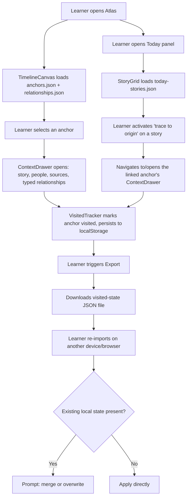

# Design: Global History Atlas (F01)

> Requirements: @requirements.md
> Status: Approved
> Approved: 2026-08-10 (Henry, direct chat approval)

## 1. Summary

Ship F01 as a static, framework-free HTML/CSS/vanilla-JS site: the newspaper-style front page (Today panel) and the lane-based Atlas timeline, both already built and independently reviewed as non-binding prototypes, become the binding implementation basis. Content (anchors, relationships, Today stories) moves out of inline `<script>` objects into standalone JSON files so it can be validated, diffed, and eventually machine-generated (F06) without touching markup. A scheduled CI job — not a backend service — refreshes the Today panel's curated news slice on an interval and publishes a static JSON file the frontend reads; there is no server, no database, and no accounts anywhere in this design, matching every Out of Scope boundary in requirements.md.

This design deliberately does **not** invent new interaction patterns where the reviewed prototypes already solved the problem — the job here is formalizing `timeline-atlas-concept.html` and `present-day-newspaper-concept.html` into binding component/data contracts, closing their known gaps (export/import, the live-news pipeline, the `--ink-faint` contrast failure), and giving them a shared content schema.

## 2. Requirements Mapping

| Requirement | Design Coverage |
|-------------|-----------------|
| FR-001 Curated pilot spine | §4 Atlas component, §5 `anchors.json` |
| FR-002 Anchor selection + drawer | §4 Atlas component (already implemented pattern: `openEvent()`/context drawer in `timeline-atlas-concept.html`) |
| FR-003 Typed relationship display | §4 Relationship layer (existing `data-relations`/arc pattern + text relationship index) |
| FR-004 Relationship focus | §4 (existing `focusRelationship()` pattern) |
| FR-005 Bounded Today panel | §4 Today component, §6 news pipeline |
| FR-006 Trace to origin | §4 (existing `trace-link` / `data-story-id` pattern, extended to cross-link into the Atlas) |
| FR-007 Visited state | §5 `visited-state` local schema |
| FR-008 Local persistence | §5 `localStorage` schema |
| FR-009 Export progress | §5 Export/Import contract (new — no prototype precedent) |
| FR-010 Import progress | §5 Export/Import contract |
| FR-011 Provenance baseline | §5 content schema (`claimType`, `source`, `date`, `confidence` fields on every anchor/relationship/story) |
| FR-012 Reduced motion | §9 Accessibility |
| FR-013 Responsive narrow layout | §8 User Flows, §9 Accessibility |
| FR-014 Topic filtering (Could Have) | §4 (existing `data-theme-filter` pattern in the Atlas; extends to Today's `data-category`) |
| FR-015 Today freshness/degraded states | §6 news pipeline, §5 freshness taxonomy |
| NFR-001 Usability | §10 |
| NFR-002 Accessibility AAA | §9, §15 Verification Strategy |
| NFR-003 Data integrity/privacy | §5, §7 |
| NFR-004 Content trustworthiness | §5, §6 |

## 3. Technical Approach

**Static site, no framework, no backend.** The product has no accounts, no server-side sync, and no real-time requirement (Today is explicitly a *bounded, scheduled* slice per D-008) — a framework or backend would be unjustified weight for what this feature actually needs. `Vite`/React/etc. remain available for a *future* feature if UI-state complexity grows enough to earn it (per `.ai/sdd/PLAN.md`'s later phases); nothing here forecloses that, since content lives in portable JSON rather than framework-specific state.

**Content as data, not markup.** `timeline-atlas-concept.html` currently embeds all 43 anchors as one large inline JS object literal. This design extracts that shape into `content/anchors.json`, `content/relationships.json`, and `content/today-stories.json` (schemas in §5), fetched by the page at load. This is the same content the prototypes already have — reshaped, not rewritten — and it's what makes FR-011's provenance fields and the eventual F06 ingestion pipeline tractable: a JSON schema can be validated in CI; a giant inline object literal can't be, practically.

**News refresh is a scheduled CI job, not a service.** Per D-008 (Option A, already decided) and the user's explicit confirmation this session: a GitHub Actions workflow runs on a fixed schedule, fetches the reviewed source allowlist, applies the freshness/validation rules in §6 (patterns borrowed from World Monitor's approach, not its infrastructure — see TD-004), and commits/publishes `content/today-stories.json`. The frontend has no knowledge of *how* that file gets refreshed; it only reads it and displays the `lastUpdated`/freshness state already inside it. This keeps hosting to "any static host" and avoids standing up Edge Functions, Redis, or a relay service that D-008 already ruled out of scope.

## 3a. Research / Prototype Inputs

- Reviewed prototype (Atlas): `.ai/sdd/design/timeline-atlas-concept.html` — component structure, relationship-arc interaction, drawer pattern, localStorage-based visited state (existing key `knewzly-timeline-concept-visited-v2`, reused/extended per §5), theme toggle.
- Reviewed prototype (Today panel): `.ai/sdd/design/present-day-newspaper-concept.html` — story card structure, `trace-link`/`data-story-id`/`data-category` pattern, drawer pattern.
- Independent review: `.ai/sdd/design/gauntlet-review-result.md` — picked the newspaper direction over the original atlas/gazette concept; flagged the atlas's `--ink-faint` contrast failure (2.5:1 light / 3.4:1 dark, fails even AA) as the one carry-forward defect this design must not repeat (see §9).
- News pipeline pattern reference (ideas only, not infrastructure): `github.com/koala73/worldmonitor` — freshness taxonomy (fresh/stale/very_stale/no_data/error), the "reduce with `min()`, fail closed on an undatable source" rule, pubdate-required gate, allowlist + CI validator. Confirmed with Henry this session: only these *patterns* are adopted, not World Monitor's actual architecture (Edge Functions, Redis, a relay service), which is out of scope per D-008 and NFR-003.
- Decisions imported: D-001 (visited state never gates access), D-003 (8-10 pilot anchors), D-004 (local + export/import, no accounts), D-005 (AAA accessibility target), D-007/D-008 (bounded scheduled curated-source feed), FR-011/NFR-004 (provenance baseline).

## 4. Component / Module Structure

```text
Atlas page (formalizes timeline-atlas-concept.html)
  TimelineCanvas
    EraAxis
    Lane (Philosophy / Europe / North America / Asia / Africa)
    Anchor (button; existing pattern: data-event, data-relations, data-theme, style-positioned)
    RelationshipLayer (SVG arcs; existing pattern: data-rel, solid=documented / dashed=interpretive)
  ThemeFilterBar (existing data-theme-filter pattern; extends FR-014)
  RelationshipIndex (existing text-equivalent list; required for FR-003's "not color/line alone")
  ContextDrawer (existing pattern: openEvent()/closeDrawer(), focus-return)
  VisitedTracker (extends existing localStorage pattern; adds FR-009/010 export/import — new)

Today panel (formalizes present-day-newspaper-concept.html)
  SectionNav (data-filter, category tabs)
  StoryGrid
    StoryCard (existing pattern: data-story-id, data-category, trace-link, source-link)
  StoryDrawer (existing pattern: openStory()/closeDrawer())
  FreshnessBanner (new — surfaces content/today-stories.json's lastUpdated + stale/error state per FR-015)

Shared
  ContentLoader (new — fetches content/*.json at load; both pages depend on this rather than inline data)
  ThemeToggle (existing pattern in both prototypes, unified into one shared module)
  ReducedMotionGuard (existing `prefers-reduced-motion` media query pattern in both prototypes, kept)
```

## 5. Data Model / State

### `content/anchors.json`

```json
{
  "anchors": [
    {
      "id": "turing",
      "title": "Turing's machine question",
      "date": { "display": "1936 / 1950", "sortKey": 1936 },
      "lane": "europe",
      "themes": ["comp", "inst"],
      "story": "<p>...</p>",
      "people": ["Alan Turing"],
      "topics": ["computability", "machine intelligence"],
      "claimType": "fact",
      "confidence": "high",
      "source": { "label": "...", "url": "...", "accessedDate": "2026-08-07" }
    }
  ]
}
```

### `content/relationships.json`

```json
{
  "relationships": [
    {
      "id": "turing-dartmouth",
      "from": "turing",
      "to": "dartmouth",
      "type": "influenced",
      "confidence": "documented",
      "claimType": "interpretation",
      "label": "Turing's machine question → Dartmouth field formation"
    }
  ]
}
```

`type` is constrained to the seven-item vocabulary in `.ai/sdd/PLAN.md` (influenced, enabled, reacted against, iterated on, institutionalized, regulated, conceptual lens). `confidence` of `documented` renders a solid arc; anything else (`interpretation`, `indirect`) renders dashed — this is the existing prototype convention, now schema-enforced rather than hand-set per `<path class>`.

### `content/today-stories.json` (CI-published, see §6)

```json
{
  "lastUpdated": "2026-08-10T14:00:00Z",
  "freshnessState": "fresh",
  "stories": [
    {
      "id": "energy",
      "category": "compute-energy",
      "headline": "...",
      "dek": "...",
      "source": { "name": "AP AI desk", "url": "...", "publishedDate": "2026-08-10" },
      "traceToAnchors": ["jevons"],
      "traceLabel": "Jevons, The Coal Question (1865)"
    }
  ]
}
```

`freshnessState` is one of `fresh | stale | very_stale | no_data | error` (World Monitor's taxonomy, adopted as a naming convention — see TD-004). FR-015 requires this state to be visible and truthful; the frontend never infers freshness itself, it only displays what the CI job already computed.

### Local state — visited anchors (`localStorage`)

Extends the existing prototype key/shape (`knewzly-timeline-concept-visited-v2` → renamed `knewzly-visited-v1` for the shipped schema, versioned so a future shape change can migrate or reset cleanly):

```json
{ "version": 1, "visited": ["turing", "dartmouth", "chatgpt"] }
```

### Export/Import file (new — no prototype precedent)

Export produces a downloadable `.json` file:

```json
{
  "exportedFrom": "knewzly-atlas",
  "schemaVersion": 1,
  "exportedAt": "2026-08-10T14:00:00Z",
  "visited": ["turing", "dartmouth", "chatgpt"]
}
```

Per NFR-003: no device fingerprinting, no fields beyond anchor IDs and the export timestamp. Import validates `exportedFrom`/`schemaVersion` before touching existing state; on a mismatch or malformed file it fails with a clear message and leaves current local state untouched (FR-010, US-005). When existing visited state is present, import asks the learner to merge (union of both sets) or overwrite before applying — never silently.

## 6. API / Integration Contract

No runtime API. The only "integration" is build-time/CI:

**Scheduled news-refresh job** (GitHub Actions or equivalent cron-capable CI, host-agnostic per this session's hosting decision):

1. Read the reviewed source allowlist (a version-controlled config file, not a JSON payload — sources are a content-review decision, not runtime data).
2. Fetch each allowlisted source; drop items with no parseable publish date (pubdate-required gate) or a future-dated timestamp, counting drops for the freshness computation.
3. Compute per-source freshness against defined thresholds, then reduce the *overall* `today-stories.json` freshness with `min()` across sources — the whole slice is only as fresh as its stalest included source, and an unparseable/undatable source fails closed to `error`, never silently to `fresh`.
4. Validate the resulting file against the `today-stories.json` schema (§5) before publishing — a CI check that fails the job rather than publishing malformed data.
5. Commit/publish `content/today-stories.json` to the same static host serving the rest of the site.

This is exactly D-008's "bounded scheduled curated-source feed," with World Monitor's specific *data-quality rules* borrowed by name (freshness taxonomy, pubdate gate, `min()`-reduction, fail-closed) and none of its runtime infrastructure (no Edge Functions, no Redis, no relay).

## 7. Security / Permissions / Privacy

- No accounts, no auth, no server-side data of any kind (D-004, NFR-003).
- `localStorage` visited state and the export file contain only anchor IDs and timestamps — never freeform text, never device identifiers.
- The scheduled news job fetches only from the reviewed allowlist; it is a build-time process with no exposure to end-user input, so it carries no injection/abuse surface from learners.
- Import (FR-010) treats any uploaded file as untrusted input: schema-validate before use, reject anything that doesn't match, never `eval`/execute file contents.

## 8. User Flows



## 9. Edge Cases

| Case | Expected Behavior |
|------|-------------------|
| `today-stories.json` fetch fails at page load | FreshnessBanner shows an explicit error state (FR-015); story grid shows its own empty/error state, never stale content presented as current |
| `today-stories.json`'s CI job hasn't run recently | `freshnessState: stale` or `very_stale` renders visibly; never silently treated as fresh |
| Learner imports a malformed/corrupted file | Reject with a clear message; existing local visited state is untouched (FR-010) |
| Learner imports a valid file while local state exists | Prompt merge/overwrite before applying (FR-010) |
| `localStorage` is disabled/unavailable (private browsing) | Visited tracking degrades gracefully — atlas remains fully browsable (per D-001, visited state is never access-gating), a non-blocking notice explains progress won't persist this session |
| An anchor has zero relationships | Relationship section of the drawer states this plainly rather than rendering an empty list with no explanation |
| A relationship references an anchor ID not present in `anchors.json` | Build-time content validation catches this before publish — treated as a content bug, not a runtime state to design around |
| Narrow viewport (< breakpoint) | Stacked, date-indexed lane cards replace the wide canvas; same relationships available as text (FR-013) |
| `prefers-reduced-motion` | All transitions (drawer, arc focus, panel changes) have a reduced-motion equivalent with no information loss (FR-012) |

## 10. Accessibility / UX Notes

Target: WCAG 2.2 AAA per NFR-002/D-005, verified the same way the independent gauntlet review already did (computed contrast ratios from actual token hex values, not eyeballing) — see §15.

- **Known defect to fix, not repeat:** `timeline-atlas-concept.html`'s `--ink-faint` token computes to 2.5:1 (light) / 3.4:1 (dark) — fails even AA. The shipped design must not reuse this token for any text; tertiary/meta text uses a token verified ≥7:1 before merge.
- Non-inline interactive controls ≥44×44 CSS px (anchors, filter buttons, drawer close, export/import triggers).
- No meaning conveyed by color alone: relationship confidence (documented vs. interpretive) is already solid-vs-dashed in the prototype, not color-only — preserved. Visited state uses a text/icon marker, not a color swatch.
- Full keyboard path: anchor selection, relationship-arc focus (mirrored in the always-available text Relationship Index), drawer open/close with focus return to the trigger, import/export controls.
- First-use guidance (NFR-001): load with one anchor pre-selected or a suggested starting trace, so a new learner doesn't face an empty canvas.
- Copy stays 16-year-old-readable without flattening uncertainty (P-002) — this is a content-authoring discipline more than a component behavior, enforced via the `claimType`/`confidence` schema fields being mandatory, not optional, on every anchor/relationship/story.

## 11. Observability / Operations

- The scheduled news job's own run log is the operational signal for Today panel health; a failed run should leave the last-good `today-stories.json` in place with its `freshnessState` correctly aging toward `stale`/`very_stale` rather than the site breaking.
- No analytics/telemetry is in scope for this feature (not requested; would need its own privacy decision per `.ai/steering/conventions.md`).

## 12. Migration / Rollout

- No migration from a prior system — this is the first shipped version.
- `localStorage` schema is versioned (`version: 1`) from day one specifically so a future shape change can detect and migrate an old key rather than silently misreading it or forcing a reset.
- Rollout is a static deploy; the scheduled news job can be validated independently (dry-run against the allowlist, check the published JSON) before the frontend depends on it.
- The pilot anchor list itself (D-006, deferred to a fast follow-up content pass) must be resolved and land in `content/anchors.json` before tasks.md's implementation tasks are finalized — this design doesn't block on it, but implementation does.

## 13. Technical Decisions

### TD-001: Plain HTML/CSS/vanilla JS, no framework

- **Decision:** Formalize the existing prototypes' vanilla-JS approach as the shipped implementation; no React/Vue/Svelte/etc.
- **Why:** No framework-shaped problem exists yet (no complex shared client state, no routing beyond two pages, no accounts). The reviewed prototypes already demonstrate the needed interactivity without one.
- **Trade-off:** Revisit if F04/F05/F08 (comparisons, quizzes, Archie) later introduce enough shared UI state that hand-written DOM management becomes the bottleneck — that's a future design's call, not this one's.
- **Alternatives considered:** A static-site generator + component framework (Astro, Vite+lib) — rejected for now as unjustified setup cost; explicitly not foreclosed later since content lives in portable JSON, not framework state.

### TD-002: Content extracted to versioned JSON, not inline script objects

- **Decision:** Move anchor/relationship/story data from inline `<script>` objects (current prototype shape) into `content/*.json`.
- **Why:** Enables CI schema validation (catches a dangling relationship ID or a missing `claimType` before it ships), keeps content diffable/reviewable independent of markup/CSS changes, and is the only way F06 (future automated ingestion) becomes tractable later.
- **Trade-off:** One additional fetch at page load versus data being immediately inline; negligible for a bounded 8-10 (later 24-30) anchor set.

### TD-003: Scheduled CI job publishes static JSON; no backend service

- **Decision:** Today's live-news requirement (D-007) is satisfied by a cron-scheduled CI job publishing `content/today-stories.json`, not a running server.
- **Why:** Matches D-008's explicit "avoids the larger near-real-time automation/moderation burden" framing and keeps hosting to "any static host," per this session's confirmed decision.
- **Trade-off:** Freshness is bounded by the schedule interval (a design/ops choice, not fixed here) rather than true real-time — this is the correct trade-off per D-008, not a shortcut.
- **Alternatives considered:** A live backend service resembling World Monitor's actual architecture (Edge Functions + Redis + relay) — explicitly rejected this session as a scope increase beyond D-008/NFR-003 that would require reopening requirements, not a design-stage choice.

### TD-004: Borrow World Monitor's data-quality patterns, not its infrastructure

- **Decision:** Adopt the freshness taxonomy (`fresh/stale/very_stale/no_data/error`), the pubdate-required gate, the `min()`-across-sources freshness reduction, and fail-closed-on-undatable-source rule as named conventions in the CI job (§6). Do not adopt Edge Functions, Redis, the relay service, Protocol Buffers, or the Tauri desktop app.
- **Why:** These are genuinely reusable data-quality *ideas*, independent of World Monitor's much larger runtime footprint, which this project's scope (bounded, scheduled, no backend) doesn't call for.
- **Source:** Confirmed with Henry this session after fetching and reporting World Monitor's actual architecture.

### TD-005: `localStorage` + downloadable-file export/import, no accounts

- **Decision:** Visited state lives in `localStorage`; portability is a manual export/import JSON file, not server sync.
- **Why:** D-004 explicitly rejected standing up an auth/DB subsystem "which doesn't exist anywhere in the project yet and would be a much larger addition" for this feature's actual need (portability, not multi-device real-time sync).
- **Trade-off:** No automatic cross-device sync; acceptable per D-004's explicit reasoning.

## 14. Risks

| Risk | Impact | Mitigation |
|------|--------|------------|
| Content JSON grows large enough (24-30+ anchors, later ingestion) that a single fetch becomes slow | Low now, Medium later | Schema is already split by concern (anchors/relationships/stories); can further split by lane/era later without a markup change |
| CI job silently stops running (e.g., disabled workflow, expired token) | Medium — stale news presented without an obvious cause | `freshnessState` ages toward `stale`/`very_stale`/`error` based on `lastUpdated`'s age, computed client-side as a floor even if the job never updates the file — never trust the job's last write alone |
| `--ink-faint`-style low-contrast token reintroduced during implementation | Medium — repeats a defect the independent review already caught once | Verification strategy (§15) requires computed contrast ratios as a build/PR check, not a one-time manual pass |
| Export/import file format needs to change later | Low | `schemaVersion` field from day one (§5) makes this a detectable, handleable migration rather than silent breakage |

## 15. Verification Strategy

- Unit/component: none yet (no test framework selected — this is itself undecided per `.ai/steering/tech-stack.md`; tasks.md must name one before writing implementation tasks with automated verification).
- Content validation: a CI check that every `relationships.json` `from`/`to` ID exists in `anchors.json`, every anchor/relationship/story has non-empty `claimType`+`source`+`date` fields (FR-011/NFR-004), and every `today-stories.json` publish passes the freshness/pubdate rules in §6 before merge.
- Accessibility: computed contrast ratios from the actual shipped token hex values (same method the independent gauntlet review already used, not a subjective pass) as a required check before merge; manual keyboard-only pass covering anchor selection, relationship focus, drawer open/close/return-focus, and import/export.
- Responsive: no horizontal overflow at 320/360/390/640/720/1440px CSS widths (NFR-002), checked at each of those widths.
- Reduced motion: verify every listed transition (FR-012) has a reduced-motion equivalent with `prefers-reduced-motion: reduce` forced on.
- E2E/manual: full loop per the Business Context success signal — browse → select anchor → read story/relationships → open a Today story → trace to anchor → see it visited → export → clear storage → import → visited state restored.
- Preferred test seam: the `ContentLoader` module and the JSON schemas are the natural seam — they can be validated and exercised without a browser, before any DOM/rendering test is needed.
- Red/green starting test: a schema-validation test asserting every `relationships.json` edge resolves to real anchor IDs — cheap, catches real content bugs, and is meaningful from the very first commit of `content/anchors.json`.

## 16. Implementation FAQ

**Q: Where does the pilot anchor content (D-006) actually get written?**
A: Directly into `content/anchors.json`/`relationships.json` following the schemas in §5, using `artifacts/planning/f01-global-history-atlas/prototype.html`'s example events as the starting draft per D-006. This is a content task, not a code task, and must land before `tasks.md`'s implementation tasks are finalized.

**Q: Do the Atlas and Today pages share one HTML file or two?**
A: Two pages (matches the two existing prototypes' separate concerns), sharing the `ContentLoader`, `ThemeToggle`, and `ReducedMotionGuard` modules described in §4 rather than duplicating that logic.

**Q: What happens if a learner opens the Atlas with JavaScript disabled?**
A: Not a supported baseline for this feature — the interactive timeline/relationship model requires JS. This is a reasonable scoping call for a 2026 web product with no server-rendering budget in this design; flag if that assumption is wrong.

**Q: Who reviews/updates the source allowlist for the news job?**
A: Content-review responsibility (like the anchor spine itself), not a code change — kept as a version-controlled config file specifically so it's reviewable without touching the CI workflow logic.

**Q: Does topic filtering (FR-014, Could Have) block this design?**
A: No — the existing prototype pattern (`data-theme-filter` on the Atlas, `data-category`/`data-filter` on Today) already covers it structurally; it's a Could Have and can be included or deferred at the tasks-planning stage without a design change either way.
