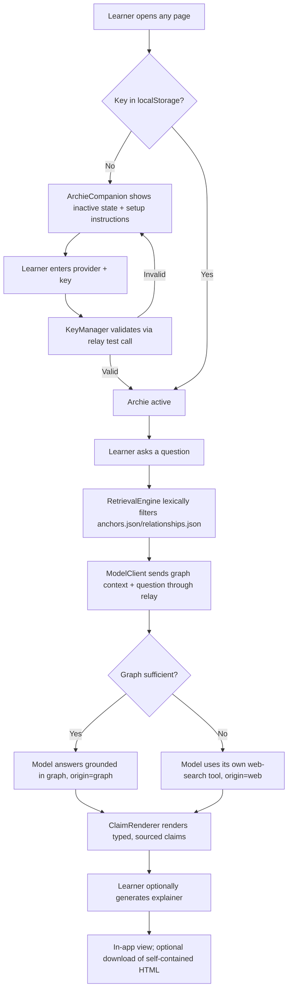

# Design: Archie — History Desk Companion (F08)

> Requirements: @requirements.md
> Status: Approved
> Approved: 2026-08-10 (Henry, direct chat approval)

## 1. Summary

Archie is a shared client-side module (`ArchieCompanion`) mounted on both pages F01's design already defines — the Atlas and Today panel — reusing F01's stack decisions rather than re-deciding them: vanilla JS (TD-001), content as versioned JSON (TD-002), and the `localStorage` persistence convention (TD-005). Archie grounds every answer in F01's own `content/anchors.json`/`relationships.json` first, via a lightweight client-side lexical filter (no vector DB, no embeddings service — unjustified weight for a curated, small dataset), and falls back to the BYOK-connected model provider's own web-search tool only when the graph doesn't cover the question.

The one new infrastructure element this design introduces — and F01 has none of — is a **minimal, stateless CORS relay**: most model provider APIs don't allow direct browser calls, so a single serverless function forwards the request/response without ever storing the key or the conversation. This preserves every privacy property NFR-003/NFR-005 require while making BYOK actually work from a static site; it is scoped as narrowly as a "backend" can be.

## 2. Requirements Mapping

| Requirement | Design Coverage |
|-------------|-----------------|
| FR-001 Claim typing | §4 `ClaimRenderer`, §5 structured response contract |
| FR-002 Source/date/freshness on every claim | §5 structured response contract (citation fields are mandatory in the model's structured output; unrendered if absent) |
| FR-003 Decline instead of fabricating | §5 (a claim with no citation is withheld by `ClaimRenderer`, not rendered as if sourced) |
| FR-004 Topic filtering | §4 `RetrievalEngine` (reuses F01's `data-theme-filter`/`data-category` convention) |
| FR-005 Trace present events to anchors | §4 `RetrievalEngine` querying `relationships.json` |
| FR-006 Explain technical/philosophical/regional relationships | §4 `RetrievalEngine` + prompt construction (§6) |
| FR-007 Surface competing interpretations | §5 (structured contract supports multiple labeled claims per topic, not a single resolved answer) |
| FR-008 Recommend further reading/video | §5 (recommendation fields require a verifiable URL; unverifiable recommendations are withheld, same rule as FR-003) |
| FR-009 Generate labeled explainer | §4 `ExplainerExporter`, resolves Q-002 |
| FR-010 Global persistent companion | §4 `ArchieCompanion` mounted on both pages |
| FR-011 Label non-Knewzly-sourced claims | §5 (`origin: "graph" \| "web"` field, always rendered) |
| FR-012 Source/date/freshness on live claims | §5, §6 |
| FR-013 Knowledge-graph-first retrieval | §4 `RetrievalEngine`, §6 prompt construction order |
| FR-014 BYOK activation gate | §4 `KeyManager`, §7 |
| FR-015 Key management | §4 `KeyManager`, §7 |
| NFR-003 Trust/Privacy | §7 |
| NFR-004 Reliability | §9 Edge Cases |
| NFR-005 Security — key handling | §7 |

## 3. Technical Approach

**Inherits F01's foundation wholesale.** No framework, no accounts, no persistent server-side state (TD-001/TD-002/TD-005 from `.ai/sdd/specs/001-global-history-atlas/design.md`). Archie is additive: a new shared module alongside F01's existing `ThemeToggle`/`ReducedMotionGuard`/`ContentLoader`, not a parallel architecture.

**Retrieval is a two-step, client-side process.** Step one: lexically filter F01's already-loaded `anchors.json`/`relationships.json` against the learner's question (matching against `title`, `topics`, `people`, and connected relationship labels) to select a small relevant subset. Step two: include that subset as grounding context in the model call, with explicit instructions that the model must prefer it and may only reach for its web-search tool to extend or verify beyond it (requirements' D-005/FR-013). This is deliberately not a vector/embedding retrieval pipeline — the curated dataset (8-10 anchors now, 24-30 later) is small enough that lexical matching is proportionate; revisit only if the graph grows far beyond that scale (see TD-002).

**BYOK calls go through one stateless relay, not Knewzly infrastructure.** The browser sends the learner's key and the request to a single serverless function on each Archie call; the function forwards it to the model provider and streams the response straight back, retaining nothing — no logs of key or content, no database, no session. This is the smallest possible technical answer to "browsers can't call most model APIs directly," confirmed with Henry this session as necessary rather than assumed away.

**Claim rendering reuses the concept mockup's existing visual grammar**, not a new one: `archie-companion-concept.html` already established solid/dashed/dotted/double left-border styling for Fact/Interpretation/Hypothesis/Analogy — `ClaimRenderer` formalizes that CSS into a shared component rather than reinventing a labeling scheme.

## 3a. Research / Prototype Inputs

- Concept mockup: `.ai/sdd/design/archie-companion-concept.html` — claim-type border grammar, freshness pill, source-strip pattern, "Generate labeled explainer" preview treatment (informs §4 `ExplainerExporter` and resolves Q-002).
- F01 design: `.ai/sdd/specs/001-global-history-atlas/design.md` — inherited stack (TD-001/002/005), `ContentLoader`/`anchors.json`/`relationships.json` shapes this design queries directly rather than duplicating.
- Decisions imported: requirements.md D-001 (open-ended knowledge scope), D-002 (independent live lookups), D-003 (global companion), D-004 (four claim types), D-005 (knowledge-graph-first), D-006 (BYOK).
- This session's design-stage decisions: CORS relay (stateless, confirmed necessary), key persistence in `localStorage` (accepted trade-off against XSS exposure, mitigated by CSP at implementation — see §7 and Risks).

## 4. Component / Module Structure

```text
ArchieCompanion (new shared module, mounted on both F01 pages per FR-010)
  KeyManager
    - entry/validation/removal UI (FR-014/FR-015)
    - reads/writes localStorage key `knewzly-archie-key-v1` (versioned, matching F01's TD-005 convention)
    - gates all other Archie behavior: no key -> inactive state, no calls attempted (FR-014)
  RetrievalEngine
    - lexical filter over F01's already-loaded anchors.json/relationships.json (§3)
    - constructs the grounding context + prompt sent to ModelClient
    - reuses F01's data-theme-filter/data-category convention for topic filtering (FR-004)
  ModelClient
    - single call surface to the CORS relay (§6); never calls a model provider directly from the browser
    - streams structured responses (§5) back to ClaimRenderer
  ClaimRenderer
    - renders claim-type badges reusing archie-companion-concept.html's border grammar
    - withholds any claim missing a citation (FR-003) rather than rendering it unlabeled
    - renders origin ("graph" | "web"), source, date, freshness per claim (FR-002/011/012)
  ExplainerExporter
    - renders an exchange to an in-app view (default) with a "Download" action producing a
      self-contained standalone HTML file carrying the same claim tags/sources unchanged (FR-009,
      resolves Q-002: in-app view + optional download, matching the concept mockup's own pattern)

Shared with F01 (reused, not duplicated)
  ContentLoader — Archie's RetrievalEngine depends on this already having loaded anchors.json/relationships.json
  ThemeToggle, ReducedMotionGuard — Archie's UI participates in the same theme/motion state, no separate toggle
```

## 5. Data Model / State

### Structured model-response contract (not persisted — per-exchange only)

Archie's model calls request a structured response shape so `ClaimRenderer` can enforce FR-001/002/003/011 mechanically rather than by parsing free text:

```json
{
  "claims": [
    {
      "text": "...",
      "claimType": "fact",
      "origin": "graph",
      "source": { "label": "...", "url": "...", "date": "1865" },
      "freshness": null
    },
    {
      "text": "...",
      "claimType": "analogy",
      "origin": "web",
      "source": { "label": "AP AI desk", "url": "...", "date": "2026-08-09" },
      "freshness": "refreshed 6 min ago"
    }
  ],
  "uncertainNote": "optional — populated only when FR-007 applies (competing interpretations)"
}
```

A claim with no `source` field is a contract violation — `ClaimRenderer` withholds it and shows "could not be verified" (FR-003) rather than rendering unlabeled prose. `origin` is mandatory on every claim so FR-011 (label non-Knewzly-sourced claims) is enforced structurally, not by the model remembering to mention it.

### `localStorage` — BYOK key

```json
{ "version": 1, "provider": "string", "key": "learner-supplied-value" }
```

Key `knewzly-archie-key-v1`, following F01's TD-005 versioning convention exactly. Removing the key (FR-015) deletes this entry and immediately re-triggers `KeyManager`'s inactive state (FR-014).

### Conversation state

Not persisted (requirements Out of Scope: no accounts, no cross-session history). Lives in page memory only for the duration of the current conversation; a page reload starts fresh. This is a deliberate requirements boundary, not a design gap.

## 6. API / Integration Contract

**The stateless CORS relay** — the one new "backend" component:

- One serverless function, one route: accepts `{ provider, key, request }` from the browser, forwards `request` to that `provider`'s API using `key`, streams the response back unmodified.
- **Statelessness is the entire security property this design relies on:** no logging of `key` or `request`/response content, no database, no session identifier tying one call to another. A request that fails mid-stream is simply an error returned to the browser — nothing about it survives server-side.
- The relay does not select or validate which providers are supported beyond basic request shape; provider-specific request/response mapping lives in `ModelClient` (client-side), keeping the relay itself provider-agnostic and genuinely minimal.

**Retrieval-order contract enforced in the prompt**, not a separate API: `RetrievalEngine` always sends the graph-filtered context first, with system-level instructions that the model must ground in it and use its own web-search tool only to extend or verify beyond it. There is no separate "web search API" Knewzly operates or selects (resolves requirements Q-001) — whatever web-search/browsing tool the learner's chosen provider natively exposes is what Archie uses, invoked with the learner's own key through the relay like any other call.

## 7. Security / Permissions / Privacy

- **Key storage:** `localStorage`, persistent across sessions (accepted trade-off this session — convenience over the smaller exposure window `sessionStorage`/in-memory would give). Mitigation named now for implementation: a strict Content-Security-Policy limiting script sources, since the real risk this trade-off accepts is XSS-readable persistent storage, not network exposure.
- **Key never reaches Knewzly infrastructure at rest:** the relay forwards it per-request and retains nothing (§6). This satisfies NFR-005 exactly as written — "never transmitted to or stored on any Knewzly-operated backend" — because *transiting* a stateless relay is not the same as being *stored* by one.
- **No conversation content is retained anywhere** — not client-side beyond the current page session, not at the relay. This exceeds NFR-003's bar (which only required not persisting across sessions) by construction, since there's nowhere for it to persist to.
- Removing the key (FR-015) is immediate and local — no server-side revocation needed, since the relay never held a durable copy to revoke.

## 8. User Flows



## 9. Edge Cases

| Case | Expected Behavior |
|------|-------------------|
| No key present | `ArchieCompanion` shows inactive state with setup instructions; no model call is attempted (FR-014) |
| Key present but invalid/expired | `KeyManager` reports the failure plainly on the next call; does not silently retry as if valid |
| Relay is unreachable (network/deploy issue) | Archie shows a clear error state, distinct from "no key" — never presented as a normal answer |
| Model returns a claim with no `source` field | `ClaimRenderer` withholds that specific claim, states it could not be verified (FR-003), does not drop the whole response |
| Graph and web search both return nothing relevant | Archie says so explicitly rather than generating a plausible-sounding answer with no citations |
| Learner removes their key mid-conversation | Archie immediately returns to the inactive state; the current (unsaved) conversation is simply gone, consistent with no persisted history |
| Provider's structured-output support is weaker than expected | `ModelClient` validates the response against the contract in §5 before passing to `ClaimRenderer`; a malformed response is treated as "could not verify," never partially trusted |

## 10. Accessibility / UX Notes

- Inherits F01's WCAG 2.2 AAA target and verification method (computed contrast, not eyeballed) for any new color introduced by claim-type badges — the existing solid/dashed/dotted/double border grammar was chosen specifically because it doesn't rely on color alone (F01's own NFR-002 principle, reused here deliberately).
- `KeyManager`'s setup flow is the one net-new UI surface with no prototype precedent; it must meet the same 44×44px target size and full keyboard operability as everything else in F01's NFR-002, since nothing in requirements.md exempts it.
- The BYOK friction flagged in requirements.md (Out of Scope: "a real friction point against P-002... design must address") is partially mitigated by persistent `localStorage` (one-time setup) but not solved — this design does not claim to resolve that tension, only to not make it worse than necessary.

## 11. Observability / Operations

- The relay's only acceptable "observability" is aggregate, content-free operational metrics (request count, error rate, latency) if any — logging key values or request/response bodies would violate the statelessness property this whole design relies on (§7). Any future logging decision must be revisited explicitly, not added incidentally during implementation.
- No conversation analytics — none is in scope, and none is possible without contradicting §7.

## 12. Migration / Rollout

- No migration — first version. `localStorage` key `knewzly-archie-key-v1` is versioned from day one (matching F01's convention) so a future key-shape change is a detectable migration, not silent breakage.
- Rollout depends on F01's `content/anchors.json`/`relationships.json` already existing with real pilot content (F01 design.md §12) — Archie's `RetrievalEngine` has nothing to filter against otherwise. This is a real sequencing dependency for tasks.md, not just a planning note.

## 13. Technical Decisions

### TD-001 (F08): Client-side lexical retrieval over the knowledge graph, not embeddings

- **Decision:** `RetrievalEngine` filters `anchors.json`/`relationships.json` by keyword/field match (title, topics, people, relationship labels), not a vector/embeddings pipeline.
- **Why:** The curated dataset is small (8-10 anchors now, 24-30 later) — an embeddings service or vector DB would be new infrastructure this project doesn't otherwise need, for a scale where lexical matching is genuinely sufficient.
- **Trade-off:** May miss a semantically related but lexically dissimilar anchor. Acceptable at current scale; revisit if the graph grows substantially larger or lexical misses prove common in practice.

### TD-002 (F08): Minimal stateless CORS relay, confirmed necessary this session

- **Decision:** One serverless function forwards BYOK calls; it stores nothing.
- **Why:** Most model provider APIs don't support direct browser calls. Without this, BYOK as specified (client-only, no Knewzly backend) may simply not work for most providers.
- **Trade-off:** Introduces the one server-side component in the entire project. Scoped as narrowly as possible specifically to preserve NFR-003/NFR-005's privacy guarantees despite that.
- **Alternatives considered:** Restricting Archie to only providers with confirmed direct-browser CORS support (rejected this session — narrows provider choice unpredictably as providers change their CORS policies over time, a worse trade than one stateless relay).

### TD-003 (F08): `localStorage` for the API key, persistent

- **Decision:** Key persists in `localStorage`, not `sessionStorage` or in-memory-only.
- **Why:** One-time setup versus re-entering a key every session/visit — chosen as the better trade for a feature already fighting real BYOK friction (requirements Out of Scope note on P-002).
- **Trade-off:** Real XSS exposure window that `sessionStorage`/in-memory would shrink. Named explicitly rather than glossed over; mitigation is a strict CSP at implementation time, not eliminated risk.

### TD-004 (F08): No separate web-search API/vendor selection

- **Decision:** Archie uses whichever web-search/browsing tool the learner's chosen BYOK provider natively exposes; Knewzly does not operate, select, or vet a separate search API.
- **Why:** Resolves requirements Q-001's provider-mechanics half. Keeps the relay provider-agnostic (TD-002) and avoids a second credential/vendor surface beyond the model key itself.
- **Trade-off:** Search quality/vetting is entirely provider-dependent and out of Knewzly's control — mitigated, not eliminated, by FR-002/003/011/012's citation requirements applying regardless of where a claim originated.

### TD-005 (F08): Explainer is in-app view + optional download

- **Decision:** Resolves requirements Q-002. `ExplainerExporter` renders in-app by default; a "Download" action serializes the same content to a self-contained standalone HTML file.
- **Why:** Matches the concept mockup's own preview pattern and avoids forcing a file round-trip just to read what was already on screen.
- **Trade-off:** None significant — this was already the requirements-stage recommended option.

## 14. Risks

| Risk | Impact | Mitigation |
|------|--------|------------|
| A provider changes its API in a way the relay's forwarding logic doesn't handle | Medium | Relay is intentionally thin (forward request/response); provider-specific mapping lives in `ModelClient`, which is easier to update per-provider than a stateful backend would be |
| `localStorage`-persisted key is read by an XSS payload | Medium-High if unmitigated | Strict CSP required at implementation (§7); named as a real, accepted risk, not hidden |
| Lexical retrieval misses a relevant anchor as the graph grows past pilot scale | Low now, Medium later | TD-001 explicitly flagged for revisit; not a silent limitation |
| Model returns confident-sounding claims that pass the structured contract but are still wrong | Medium — a structural contract catches *unsourced* claims, not *false but sourced-looking* ones | Out of this design's power to fully solve; FR-007's competing-interpretations requirement and visible sourcing are the mitigation, not a guarantee |

## 15. Verification Strategy

- Unit/component: `ClaimRenderer` given a response with a missing `source` field must withhold that claim, not render it — this is the cheapest, most meaningful first test (mirrors F01's own "red/green starting test" pattern of testing the content/data contract before any UI).
- Contract validation: any `ModelClient` response failing the §5 structured shape is treated as unverifiable, never partially trusted — testable without a live model call using fixture responses.
- Manual: full BYOK flow (no key → setup → valid key → active; remove key → inactive again); a graph-answerable question (verify `origin: graph`); a graph-gap question (verify `origin: web` and that the relay round-trip works); explainer generation preserves every tag/source from the original exchange unchanged (FR-009 acceptance criteria).
- Security: confirm via network inspection that no request to the relay logs or persists key/content (this is the one property the whole privacy design rests on — must be verified, not assumed from the code).
- Accessibility: `KeyManager`'s new UI surface checked against F01's existing AAA verification method (computed contrast, 44px targets, full keyboard path).

## 16. Implementation FAQ

**Q: Does the relay need its own repository/deploy pipeline, or does it ship alongside the static site?**
A: Alongside — most static-hosting platforms support a colocated serverless function without a separate service to operate. Exact platform is unspecified per F01's hosting decision (any static host); the relay just needs wherever that host is to also support one function.

**Q: What happens to an in-flight conversation if the learner's key expires mid-session?**
A: The next call fails with a clear "key invalid" state (Edge Cases, §9); the conversation so far stays visible (not persisted, but not wiped either) until the learner adds a valid key or navigates away.

**Q: Can Archie ever answer without any model call at all, e.g. for a purely graph-lookup question?**
A: Design keeps this simple: every Archie answer goes through the model (with graph context attached), even when the graph alone could technically answer it — a pure client-side "just render the anchor" path would duplicate F01's own `ContextDrawer`, which already does that without Archie.

**Q: Does the explainer download include the BYOK key or provider name anywhere?**
A: No — `ExplainerExporter` serializes only claims, sources, dates, and origins (§5's structured contract minus any key/provider metadata). This is a hard requirement, not an oversight to catch later.
