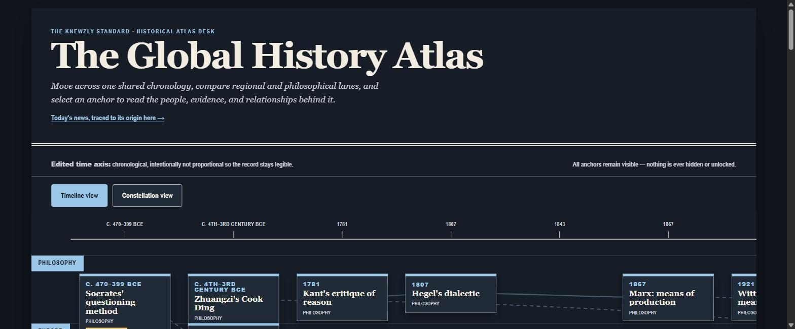
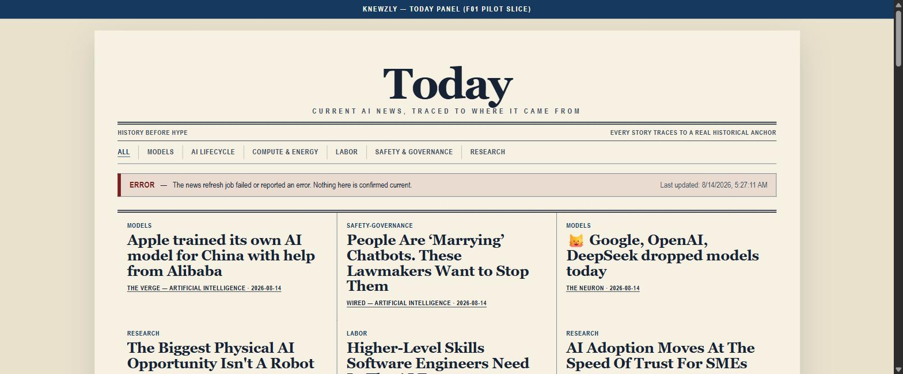

# Knewzly

Explore AI/innovation history as one connected timeline across regions, then trace today's AI news back to the historical event it descends from.

[**Live demo**](https://knewzly-global-history-atlas.vercel.app) · [Docs](docs/) · [License](LICENSE)

## Series context

Knewzly is the proof object for [*No Idea Is Original*](https://henryflowers45.substack.com/p/no-idea-is-original) ([LinkedIn article](https://www.linkedin.com/pulse/idea-original-henry-flowers-cpa-95abc)), part of the *Looping in the Human* series.



## Features

- A curated 50-anchor history spine (1940s–present) laid across time and region/philosophy lanes, with typed relationships between events.
- A toggleable constellation view — the same anchors and relationships as a force-directed graph.
- A context drawer on every anchor: the people, sources, and story behind it.
- Visited-anchor tracking in your browser, exportable/importable as a JSON file — no account.
- A scheduled, curated Today panel tracing current AI news back to its historical anchor, filterable by category.
- Newspaper-style Today layout with a small, human-reviewed news-source allowlist.

## Quick start

```bash
git clone https://github.com/flowersbl00minadarkr00m/knewzly.git && cd knewzly
python -m http.server 8000
```

Open `http://localhost:8000/atlas.html` for the timeline, or `http://localhost:8000/today.html` for the news panel.



## How it works

Static pages, no backend, no build step — content lives as versioned JSON validated against schemas. Maintainers run `node scripts/refresh-today.js` to refresh the versioned review queue. A scheduled GitHub Actions job rechecks the bounded source allowlist for freshness and publishes only queue entries a maintainer has already marked reviewed; fetched-but-unreviewed network content is never committed automatically. Details: [docs/architecture.md](docs/architecture.md).

## Privacy

- No accounts, no server-side sync — visited-anchor progress lives only in your browser.
- Export/import is a plain JSON file you control.
- Details: [docs/privacy.md](docs/privacy.md).

## Testing

```bash
npm test
```

## License

[MIT](LICENSE)
